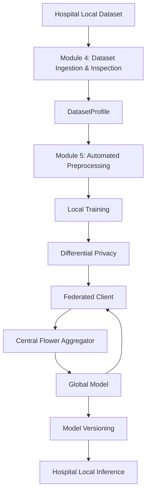

# Machine Learning Architecture Overview

This document outlines the broader Machine Learning pipeline for the "Secure and Privacy-Preserving Federated Deep Learning Training Platform for Medical Imaging." 

It defines the boundaries between dataset inspection, preprocessing, local training, differential privacy, and federated orchestration.

---

## 1. ML Architecture Overview

The system architecture flows from the local hospital dataset up to a secure, globally aggregated model, and back down to the local hospital for clinical inference.

### Implementation Status:
- **IMPLEMENTED:** Module 4 (Dataset Ingestion & Inspection), DatasetProfile generation.
- **PLANNED / NEXT:** Module 5 (Automated Preprocessing), Model Management, Local Training.
- **FUTURE:** Differential Privacy, Federated Client/Server communication, Model Versioning, Inference.

---

## 2. Privacy Boundary
The fundamental design philosophy is raw-data locality:
- Raw medical images and tabular patient records **stay entirely at the hospital**.
- Preprocessing and model training execute locally.
- **Only** mathematical model updates (e.g., parameter gradients/weights) and system telemetry leave the hospital.
- The central aggregation server receives numerical model updates, not raw medical images. 
*(Note: Federated learning minimizes exposure, but it does not mean absolutely zero data leaves the hospital—model weights themselves require cryptographic/differential protections to prevent inversion attacks, which is handled in later modules).*

---

## 3. Module 4's Role in ML
**Module 4 is strictly the entry point.**
It acts as the dataset gateway. 

- **Outputs:** `DatasetProfile`, `dataset_profile.json`, `dataset_report.md`.
- **Exclusions:** Module 4 **does not** preprocess, train, aggregate, apply differential privacy, or perform inference.

---

## 4. Module 4 → Module 5 Contract
The output of Module 4 (`dataset_profile.json`) serves as the conceptual interface to Module 5 (Automated Preprocessing Engine). `DatasetProfile` is used as an input metadata contract that informs preprocessing decisions (such as dynamic configuration of data-loaders, tensor normalizations, categorical encodings, and missing-value imputations).

---

## 5. ML Model Architecture
**(Planned / Future Module)**
- **Primary Recommended Model:** EfficientNet-B0 (chosen for its balance of high accuracy and low parameter count, optimizing federated bandwidth).
- **Extensibility:** The architecture is designed to eventually support plug-and-play PyTorch models, such as MobileNetV2, ResNet18, and other lightweight CNNs. 
*(Note: These ML models are not yet implemented in the current repository codebase).*

---

## 6. Local Training Architecture
**(Planned / Future Module)**
The intended PyTorch local-training flow:
1. **Local Dataset**
2. **Preprocessing** (Module 5)
3. **DataLoader** (Batching and Shuffling)
4. **CNN Model** (Forward Pass)
5. **Loss Calculation** (e.g., CrossEntropy)
6. **Backpropagation**
7. **Optimizer** (e.g., Adam/SGD)
8. **Validation / Evaluation** (Against local test splits)
9. **Local Model Update** (Yielding weights for federation)

---

## 7. Resource-Aware Training
**(Planned / Future Module)**
Local hospital nodes will possess heterogeneous hardware. The training orchestration will implement resource awareness:
- Probing GPU availability (CUDA/ROCm).
- Dynamically sizing `batch_size` based on available GPU VRAM and System RAM.
- CPU fallback mechanisms for nodes without dedicated accelerators.

---

## 8. Federated Learning Architecture
**(Planned / Future Module)**
The platform employs a **Federated/Distributed architecture with a central orchestrator** (not fully decentralized peer-to-peer).
- **Hospital Clients:** Perform local training for $E$ epochs.
- **Central Flower Server:** Orchestrates the rounds, selecting participating clients.
- **Aggregation:** Collects local model updates and merges them using federated strategies (e.g., FedAvg or FedProx to handle non-IID clinical data).
- **Distribution:** Pushes the updated Global Model back to the clients for the next round.

---

## 9. Differential Privacy
**(Planned / Future Module)**
To mitigate model inversion and membership inference attacks against the model weights:
- Executes within the Local Training loop.
- Relies on **Gradient Clipping** to bound the influence of any single patient record.
- Injects calibrated statistical **Noise** into the gradients before creating the protected model update sent to the federated aggregator.

---

## 10. Byzantine/Malicious Update Detection
**(Planned / Future Module)**
Securing the central aggregator against compromised hospital nodes or bad actors poisoning the global model. Requires robust aggregation functions to identify and discard statistical outliers during the global update phase.

---

## 11. Secure Communication
**(Planned / Future Module)**
The conceptual boundary relies on authenticated, encrypted channels (e.g., mutual TLS) between the hospital Flower Client and the backend Flower Server/Aggregator.

---

## 12. Model Versioning
**(Planned / Future Module)**
- Tracking global model versions across training rounds.
- Saving PyTorch checkpoints.
- Maintaining metadata regarding the training round association for regulatory reproducibility and rollback.

---

## 13. Local Inference
**(Planned / Future Module)**
- The final, approved Global Model is deployed and loaded locally at the hospital.
- New patient images generated by the hospital remain local.
- Module 5 preprocessing routines are applied to the new images.
- Inference occurs entirely locally without querying the central server.

---

## 14. ML Component Boundaries

| Component | Responsibility | Data Location | Output | Status |
| :--- | :--- | :--- | :--- | :--- |
| **Module 4** | Dataset detection, validation, profiling | Local Hospital | `DatasetProfile` JSON | **IMPLEMENTED** |
| **Module 5** | Data loading, normalization, imputation | Local Hospital | PyTorch DataLoaders | PLANNED |
| **Model Mgmt** | Initializing and tracking CNN architectures | Local Hospital | PyTorch `nn.Module` | PLANNED |
| **Local Training** | Forward/Backward pass, optimizer stepping | Local Hospital | Local Model Weights | PLANNED |
| **Resource-Aware** | Hardware profiling, dynamic batch sizing | Local Hospital | Config Parameters | PLANNED |
| **Differential Priv** | Gradient clipping, noise addition | Local Hospital | DP Model Weights | FUTURE |
| **Federated Comm** | Sending weights to/from aggregator | Network (Encrypted) | Byte Streams | FUTURE |
| **Central FL** | Orchestrating clients, aggregating weights | Central Server | Global Model Weights | FUTURE |
| **Byzantine Det.** | Defending aggregator from poisoned updates | Central Server | Filtered Weights | FUTURE |
| **Versioning** | Saving checkpoints and metadata | Central Server | `.pth` Checkpoints | FUTURE |
| **Local Inference** | Serving model for model predictions | Local Hospital | Predictions | FUTURE |

---

## 15. Design Principles
- **Raw-Data Locality:** Raw medical datasets remain within the hospital-side environment and are not transmitted to the central federated aggregation service.
- **Modularity:** Isolated components (e.g., Module 4 operates purely on files, Module 5 operates purely on tensors).
- **Non-destructive Handling:** The system strictly reads datasets and never alters source files.
- **Reproducibility:** Statistical profiling and versioning ensure traceable ML provenance.
- **Resource Awareness:** Democratizing ML participation across hospitals with varying IT hardware.

---

## 16. Current vs Future Architecture
The current repository implementation is constrained strictly to **Module 4**. Any claims regarding federated learning, gradient descent, model structures, or cryptography in this document refer to the **planned architectural roadmap**, not the current codebase.

