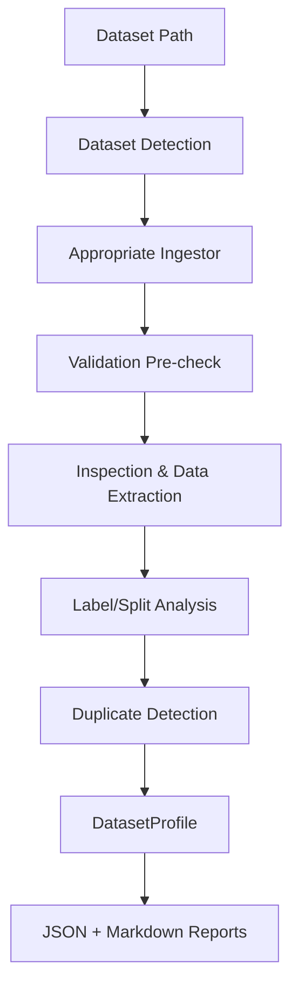

# Module 4: Dataset Ingestion and Inspection

## 1. Module Overview
- **Module Number:** 4
- **Module Name:** Dataset Ingestion and Inspection
- **Purpose:** Provide a robust, privacy-preserving local gateway for discovering, inspecting, validating, and profiling raw medical imaging and tabular datasets.
- **Scope:** Runs completely on the hospital's local environment. Evaluates dataset structure, checks file integrity, extracts statistics, and builds a standardized JSON profile.
- **What it does:** Scans directories, validates supported file formats, detects dataset splits and classes, assesses class distribution, inspects CSV/XLS/XLSX schemas, finds duplicates, and generates metadata reports.
- **What it explicitly does NOT do:** It does *not* modify, move, or delete original files. It does *not* resize images, normalize pixels, or augment data. It does *not* train models, perform federated learning, or transmit raw pixels to external servers.

## 2. Responsibilities
Module 4 is responsible for:
- Dataset type detection (Image, CSV, Excel)
- Image dataset ingestion (via Pillow)
- CSV ingestion (via Pandas)
- XLS/XLSX ingestion (via Pandas/xlrd/openpyxl)
- Recursive image discovery
- Image readability validation
- Image dimensions and channel (color mode) tracking
- Image statistics aggregation
- Split detection (e.g., `train/`, `test/`)
- Class/label detection (nested directories)
- Class distribution calculation and imbalance warnings
- Tabular schema inspection
- Missing-value inspection
- Duplicate detection (exact image hashing, tabular row duplicates)
- Candidate target-column detection (based on low cardinality)
- Dataset profiling
- JSON report generation (`dataset_profile.json`)
- Markdown report generation (`dataset_report.md`)
- Validation and graceful error reporting
- Preserving the original dataset intact

## 3. Supported Dataset Types
### IMAGE
- `.jpg`, `.jpeg`, `.png`, `.bmp`, `.tif`, `.tiff`, `.webp`
- *Information Collected:* File counts, corruptions, minimum/maximum/average dimensions, color modes (`RGB`, `L`, `RGBA`), classes, dataset splits, class distributions, and exact duplicates.

### TABULAR
- **CSV:** Handled natively.
- **XLS:** Handled via `xlrd`.
- **XLSX:** Handled natively.
- *Information Collected:* Rows, columns, datatypes, missing values, duplicate rows, constant columns, high-cardinality flags, candidate targets (categorical columns with unique value counts >1 and <=10), and multiple worksheets (Excel).

## 4. Input Dataset Structure
For image datasets, the system recursively discovers structures such as:
- `dataset/train/benign/` and `dataset/test/malignant/` (detects `train`, `test` splits and `benign`, `malignant` classes)
- `dataset/benign/` and `dataset/malignant/` (detects classes, zero splits)
- Unstructured flat directories.

The implementation intelligently differentiates standard split keywords (`train`, `val`, `validation`, `test`) from target classes.

## 5. Image Dataset Inspection
- **Discovery:** Recursively walks directories.
- **Formats:** Uses Pillow to open and verify file headers.
- **Corrupted:** Catches `IOError` or zero-byte files, tracking them as `invalid_samples` without crashing.
- **Stats:** Tracks `min_width`, `max_width`, `avg_width` (and height), and counts modes like `L` (grayscale) vs `RGB`.
- **Imbalance:** Compares class counts and generates a `Class distribution is imbalanced.` warning if extreme ratios are detected.
- **Duplicates:** Hashes every verified image via SHA-256 (`compute_file_hash`). Identical hashes increment the duplicate counter.

## 6. CSV Inspection
- **Schema:** Tracks total rows, columns, and inferred pandas data types.
- **Missing Values:** Calculates missing counts and percentages per column.
- **Duplicates:** Identifies duplicate rows globally.
- **Categorical targets:** Identifies categorical columns with 2 to 10 unique values as `candidate_target_columns`. (It does *not* automatically choose a final target).
- **Warnings:** Flags `constant` columns (1 unique value) and `high cardinality` columns (highly unique columns like patient IDs).
- **Graceful Failure:** Malformed or zero-byte CSV files append to the `errors` array instead of throwing fatal runtime exceptions.

## 7. XLS/XLSX Inspection
- **Worksheets:** Automatically discovers all worksheets inside the workbook.
- **Schema:** Computes schema, rows, missing values, duplicates, and candidates independently *per sheet*.
- **Genuine XLS:** Genuine binary `.xls` processing is fully supported and tested via `xlrd`.

## 8. Duplicate Detection
- **Image:** Computes a SHA-256 chunked hash of the file contents (not relying on filenames).
- **Tabular:** Uses Pandas `duplicated()` logic to find exact row-level duplicates.
- **Action:** Duplicates are simply reported in the metadata. The source data is *never* deleted or modified.

## 9. Dataset Profile
The `DatasetProfile` is a standardized data contract passed to later modules, exported as JSON.
**Fields:**
- `dataset_type`: "Image", "CSV", or "Excel"
- `source_path`: Absolute path to the original local dataset.
- `total_samples`: Total files or tabular rows.
- `valid_samples` / `invalid_samples`: Outcome of readability validation.
- `missing_samples`: Deprecated/Future expansion.
- `image_statistics` / `tabular_statistics`: Dictionary of extracted schemas, dimensions, and candidate targets.
- `splits`: Standard splits detected.
- `classes`: Unique target classes found.
- `class_distribution`: Dictionary of class counts.
- `duplicate_information`: Exact duplicate counts.
- `missing_data_information`: Dictionary of missing rows/percentages.
- `warnings` / `errors`: Non-fatal notifications and file-specific corruptions.
- `generated_at`: ISO 8601 UTC timestamp.

## 10. Generated Outputs
- **`dataset_profile.json`**: The complete machine-readable profile to be consumed by Module 5 (Preprocessing).
- **`dataset_report.md`**: A human-readable Markdown summary intended for clinicians and data scientists.
- **Privacy Note:** These files contain metadata, statistics, validation results, and inspection information. No raw medical images, pixels, or full tabular records are exported.

## 11. CLI Usage
The module exposes a Python entry point designed to be invoked directly:

```bash
python -m hospital_client.dataset inspect <dataset_path> --output <output_directory>
```

**Examples:**
```bash
# Image Dataset
python -m hospital_client.dataset inspect C:\Data\Lung_Xrays --output C:\Reports

# CSV Dataset
python -m hospital_client.dataset inspect C:\Data\patients.csv --output C:\Reports

# Excel Dataset
python -m hospital_client.dataset inspect C:\Data\records.xlsx --output C:\Reports
```

## 12. Validation and Error Handling
Handled comprehensively across multiple layers:
- **Routing Layer (`dataset_detector.py`):** Eagerly catches `ValueError` for nonexistent paths or unsupported root files (e.g., `.pdf`).
- **Validation Layer (`validation.py`):** Catches permission errors and zero-byte files prior to deep processing.
- **Ingestion Layer:** Captures deep malformations (e.g., corrupted bytes inside an `.xlsx` or an unreadable `.jpg` header) using safe `try/except` wrappers.

## 13. Privacy and Data Handling
Module 4 is designed for local dataset inspection and does *not* transmit the raw dataset as part of its inspection workflow. 
- It operates entirely in the hospital-side local environment.
- Raw medical images remain in the local dataset location.
- Generated reports contain metadata, statistics, validation results, and inspection information, but do not contain raw image pixels or complete raw tabular records.

*(Note: Module 4 itself does not provide cryptographic federated guarantees; it simply respects dataset locality).*

## 14. Dataset Immutability
Module 4 is strictly read-only and does not modify source datasets.
- 
- It does not resize images, alter formats, or write back to the CSV.
- This is explicitly verified via pre- and post-inspection SHA-256 hashing in the test suite (`test_immutability.py`).

## 15. Module 4 Internal Architecture
```text
hospital_client/
└── dataset/
    ├── __init__.py
    ├── __main__.py               # CLI Entry point
    ├── cli.py                    # Legacy CLI router
    ├── ingestion/
    │   ├── __init__.py
    │   ├── dataset_detector.py   # Routes path to appropriate ingestor
    │   ├── duplicate_detection.py# SHA-256 file hashing
    │   ├── excel_ingestor.py     # Workbook multi-sheet parser
    │   ├── image_ingestor.py     # Pillow-based directory parser
    │   ├── label_detection.py    # Class and split inference logic
    │   ├── report_generator.py   # JSON and Markdown dumpers
    │   ├── tabular_ingestor.py   # CSV schema inspection
    │   └── validation.py         # File integrity pre-checks
    ├── models/
    │   ├── __init__.py
    │   └── dataset_profile.py    # DatasetProfile dataclass schema
    └── tests/                    # 21 comprehensive pytest cases
```

## 16. Component Responsibilities

| Component | Responsibility |
| :--- | :--- |
| `dataset_detector` | Checks path, determines file extension, routes to correct ingestor. |
| `validation` | Checks OS existence, file permissions, and zero-byte conditions. |
| `image_ingestor` | Discovers images, extracts Pillow metadata, handles broken images. |
| `label_detection` | Infers classifications and splits based on directory tree structure. |
| `duplicate_detection`| Computes SHA-256 hashes to find strictly identical files. |
| `tabular_ingestor` | Parses CSVs via Pandas, evaluates cardinality, schemas, and missing values. |
| `excel_ingestor` | Parses XLS/XLSX workbooks via Pandas, iterating through all sheets. |
| `report_generator` | Serializes the python dataclass into standardized JSON and Markdown. |

## 17. Data Flow


## 18. Module 4 to Module 5 Boundary
- **Module 4 (Current):** Discovers, validates, inspects, profiles, reports.
- **Module 5 (Planned):** Consumes the `DatasetProfile.json` to execute dynamic preprocessing.

Module 4 explicitly does *not* normalize images, generate bounding boxes, execute one-hot encoding, execute Dataset splitting, or train ML models. It establishes the input contract for Module 5.

## 19. Testing
The implementation is thoroughly verified via an automated test suite.
- **Test Results:** 21 tests passed, 0 failures.
- **Measured Code Coverage:** 88%

**Verified Categories:**
- CLI Execution
- Routing/Dataset detection
- Image format compatibility
- Unsupported/Corrupted image handling
- Predefined splits & zero-split classes
- Class Imbalance warnings
- CSV and malformed CSV handling
- XLS and XLSX parsing (genuine multi-sheet logic)
- Missing value, constant column, and cardinality tests
- Privacy boundary checks (preventing data leaks in profiles)
- Dataset immutability hashes

## 20. Test Coverage Note
The 88% measured coverage means the majority of implemented code was exercised, while the remaining coverage consists primarily of CLI subprocess and defensive/edge-case branches.

## 21. Known Limitations
- The module extracts metadata but does not guarantee the *clinical* validity of the images.
- Inspection is strictly schema and file-level; it does not train models or execute federated learning.

## 22. Future Integration
Later modules (Module 5: Automated Preprocessing) are intended to programmatically consume `dataset_profile.json` to automatically determine resizing bounds, normalizations, and imputations.

## 23. Completion Status
- **Module 4: Dataset Ingestion and Inspection**
- **Status:** Functionally complete
- **Automated tests:** 21/21 passing
- **Measured coverage:** 88%

